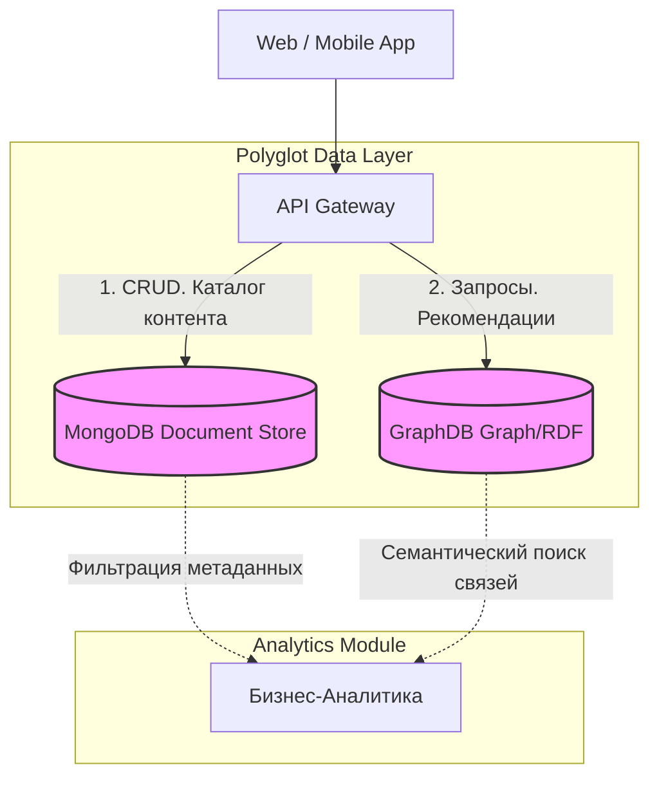

# Практическая работа 2. Изучение и применение различных типов NoSQL баз данных на бизнес-кейсах

**Студент:** Савкина Мария Алексеевна

**Группа:** БД-251м

**Вариант:** 25

### Введение. Описание бизнес-кейса и выбранного стека технологий.

Целью данной работы является разработка концепции аналитического ядра для стриминговой платформы. Применение одной реляционной системы управления базами данных для решения всех задач оказывается недостаточно эффективным, т.к. платформы работают с большими объемами разнородных данных: каталогами фильмов, пользовательскими действиями, рекомендациями, логами системы и т.д., поэтому используется подход Polyglot Persistence, предполагающий использование нескольких типов баз данных, каждая из которых оптимизирована под определённые задачи.

**MongoDB (Document Store)** применяется для хранения каталога медиаконтента и пользовательских профилей. Благодаря гибкой структуре документов в формате JSON появляется возможность легко расширять модель данных и добавлять новые характеристики, например поддержку различных форматов видео или дополнительных типов подписок. В рамках индвидуального задания варианта 25 будет реализовано хранение системных логов с применением capped collections (кольцевые коллекций). Такой тип коллекций имеет фиксированный размер и автоматически удаляет самые старые записи при добавлении новых. Это позволяет эффективно хранить поток логов системы, отслеживать события платформы и контролировать активность пользователей без необходимости дополнительного управления очисткой данных.

**GraphDB (Graph/RDF)** используется для реализации рекомендательной системы. Графовые базы данных позволяют эффективно работать со сложными взаимосвязями между объектами (пользователь → поставил лайк → фильм → относится к жанру → связан с похожим фильмом). Такая структура данных упрощает анализ связей и формирование рекомендаций для пользователей. В рамках варианта рассматриваются примеры поиска фильмов с участием Tom Hanks и Julia Roberts, а также фильмов Nicole Kidman и Tom Cruise, выпущенных до 1980 года.

### Архитектура решения

