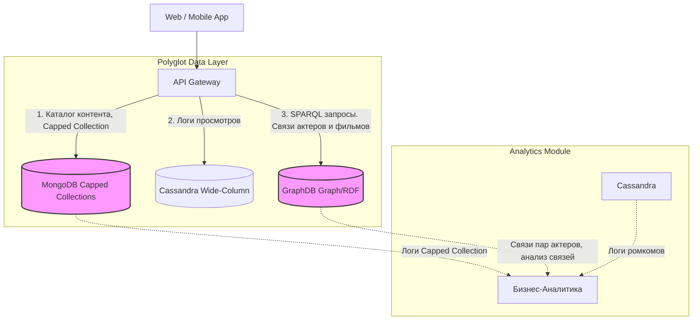

# Практическая работа 2. Изучение и применение различных типов NoSQL баз данных на бизнес-кейсах

**Студент:** Савкина Мария Алексеевна

**Группа:** БД-251м

**Вариант:** 25

### Введение. Описание бизнес-кейса и выбранного стека технологий.

Цель проекта — создание архитектуры данных на базе принципа Polyglot Persistence, где каждая база данных решает свою задачу:

- MongoDB (Документная СУБД): Хранение каталога контента и профилей. Гибкая структура JSON позволяет оперативно менять метаданные и форматы подписок без остановки системы.

- Cassandra (Wide-Column): Сбор логов и кликстрима (паузы, перемотки). За счет высокой пропускной способности она идеально справляется с интенсивным потоком событий в реальном времени.

- GraphDB (Графовая СУБД): Движок рекомендаций. Эффективно анализирует цепочки связей (актеры, жанры, предпочтения) для формирования точных персональных подборок.

### Архитектура решения

### Технологический стек

*ОС:* Ubuntu 22.04 (VM Клон devops_dba_25).

*Контейнеризация:* Docker (версия 28.0.0) и Docker Compose (версия v2.33.0). 

*СУБД*: MongoDB 7.0, GraphDB

*Среда разработки:* JupyterLab (Python 3.10), библиотеки pymongo, Faker.

## 2. Развертывание инфраструктуры

## 3. Генерация и проверка баз данных (Python + Faker)

